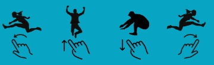
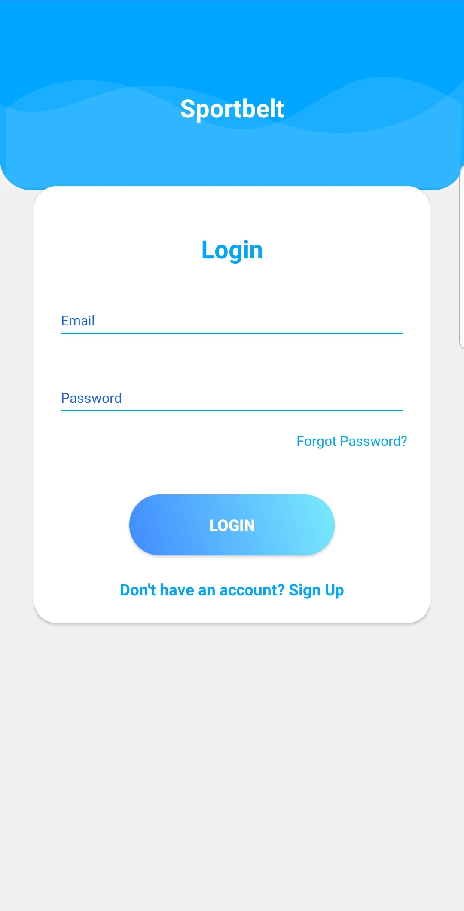
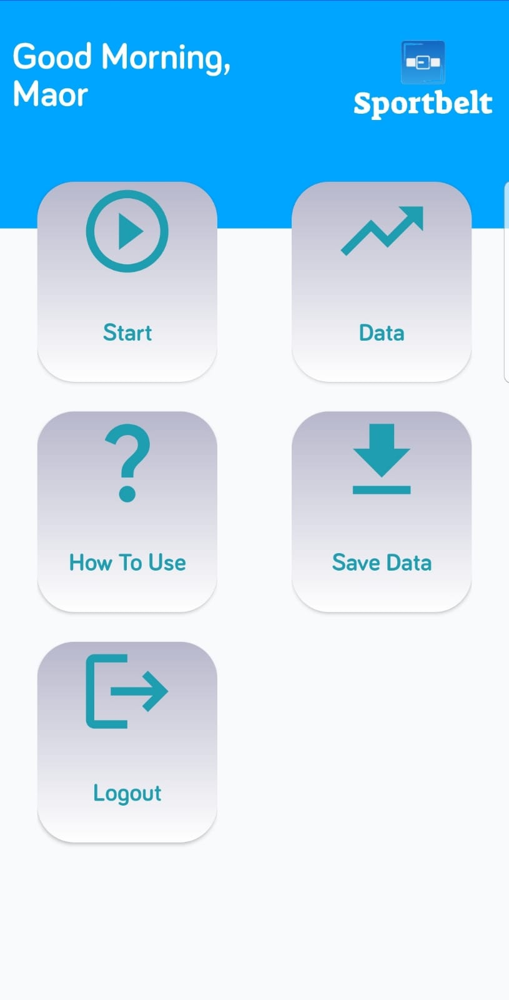
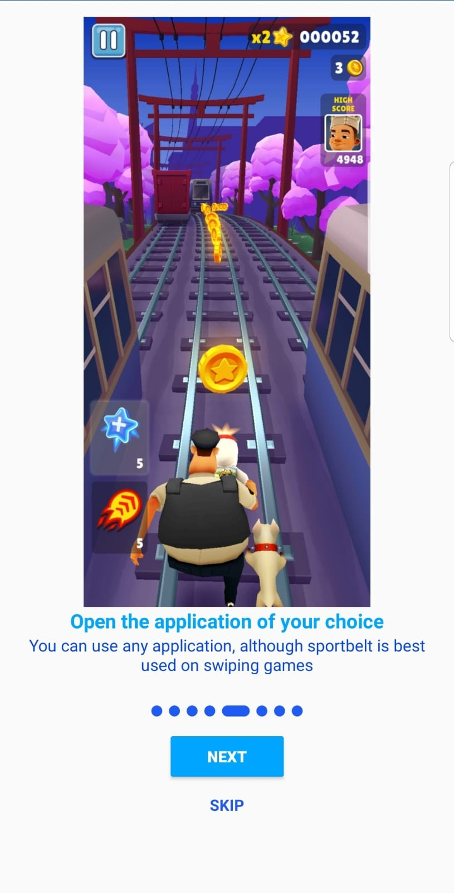
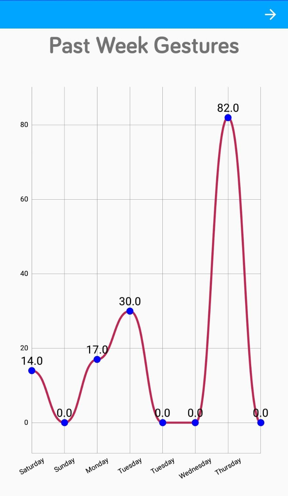

With the advancement of technology, more and more children are opting for sedentary screen time rather than participating in traditional sports and outdoor games. Sportbelt aims to bridge this gap by offering a solution that combines the convenience of smartphone usage with physical exercise.
Sportbelt comprises a belt-mounted hardware device and an accompanying Android application. When the user activates the application and wears the belt, the hardware component enables a range of motion-based functionalities. moving left, right, jumping and crouching will trigger a left, right, upward and downward swipe correspondingly. these actions performed best with swiping games, although they work with all smartphone applications. In addition, all previous data can be seen and analyzed from the app later.
By incorporating physical movements into smartphone interactions, Sportbelt encourages users to engage in exercise while using their phones. This innovative approach allows children, and potentially users of all ages, to continue enjoying their mobile devices while promoting an active lifestyle.
# How to use:
move or jump left/right/up or crouch for the phone to swipe left/right/up or down respectively.

# Showcase:
<video src='https://github.com/maor1122/Sportbelt/assets/62097305/6bd44a3d-3570-44eb-adb9-35b1e2ca8d10' height='400' width='600' autoplay loop>
</video>

  
  
  
  

# How to start the service:
Download the application, register/login, turn on the hardware component, and press start!

